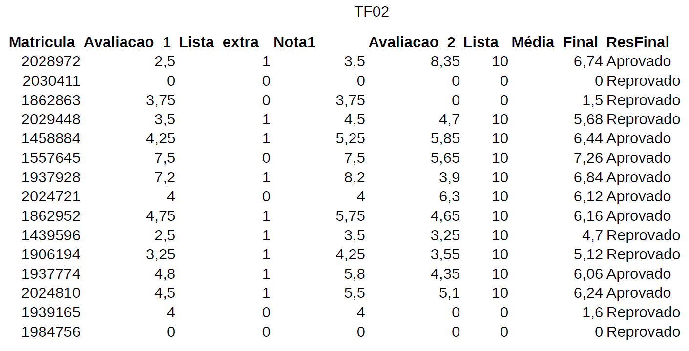

```{r setup, include=FALSE, cache=FALSE}
source("setup_knitr.R")
## library(ggplot2)
## library(tidyverse)
## library(viridis)
smf <- function(x) 
  sum(sort(x, decreasing = TRUE)[1:5], na.rm=TRUE)/5
mpf <- function(x) 
  sum(sort(x, decreasing = TRUE)[1:2], na.rm=TRUE)/2
decf <- function(x) 
  ifelse(x<39, 'Reprovado', 
         ifelse(x>69, 'Aprovado', 'Final'))
```

## Escolha a aba de sua turma {.tabset}

### MA70H - Probabilidade E Estatística - TF02




```{r notasgeologia}
#nt <- read.csv2('misc/TF02.csv',sep=',')
#nt$SM <- apply(as.matrix(nt[, 4:11]), 1, smf)
#nt$MediaParcial <- apply(as.matrix(nt[,c(2,3,12)]), 1, mpf)
#nt$ResultParcial <- decf(nt$MediaParcial)
#kable(nt, row.names = FALSE)
```


### MA70H - Probabilidade E Estatística	S03

### MA70H - Probabilidade E Estatística	S51


### MA70H - Probabilidade E Estatística	S73


```{r notasnea, eval=FALSE}
nt <- read.csv2('misc/NutEngAmb.csv')
##nt$SM <- apply(as.matrix(nt[, 4:11]), 1, smf)
##nt$MediaParcial <- apply(as.matrix(nt[,c(2,3,12)]), 1, mpf)
##nt$ResultParcial <- decf(nt$MediaParcial)
kable(nt, row.names = FALSE)
```

